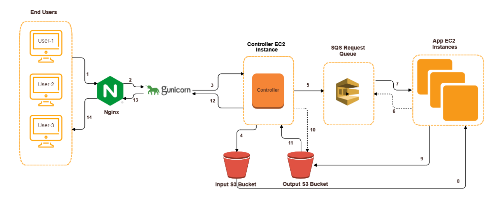

# aws-iaas-cloud-classifier
AWS IaaS based Deep Learning Classifier application which automatically scales-out and scales-in based on load. The Controller node receives the image request from user and utilizes AWS services to recognize the image and display the
result back to the user. Design capable to handle multiple image uploads and concurrent requests.

## Architecture

### End-To-End flow
- The user uploads multiple images using the hosted website.
-  The POST request is routed to Nginx server which acts as a reverse proxy for Gunicorn web server. Nginx is used to directly serve the static HTML and CSS files **(1)**.
-  Nginx routes the request to Gunicorn WSGI HTTP server **(2)**. Both Nginx and Gunicorn are used to deploy the controller application.
-  The controller is the master node of our application. After receiving the request **(3)**, it assigns a unique prefix to the image name which acts as the image-id. 
-  The controller then uploads the images into the input S3 bucket with key: image-id and value: Image **(4)**.
-  The controller sends all the image-ids to the SQS request queue **(5)**. 
-  After that, the controller starts up the required Application EC2 instances based on the total messages in the SQS request queue, max images each instance can handle and total possible maximum instances. Max images per instance and total maximum instances are 
configurable at the Controller’s end.
-  The Application EC2 instances after booting up automatically execute the worker application. The worker applications start request queue polling to fetch the image-ids to process **(6)**.
-  After getting the image-ids from the request queue **(7)**, the application fetches the corresponding image from the Input S3 bucket **(8)**.
-  The application instance then runs the Deep Learning classifier model on the image to compute the prediction result.
-  After processing the image and getting the prediction result, the app instance deletes the image-id from the request queue. Then it serializes the prediction result string into an object and uploads it to the Output S3 bucket where key: image-id and value: Serialized 
prediction object **(9)**.
-  In controller, every concurrent request spawn a new handler thread. Each thread iterates over the set of image-ids it received in the POST request. Then for each image-id, the controller node thread queries the output S3 bucket to get the prediction output **(10)**. This polling mechanism is run continuously by each thread until each of them receives the prediction output for all the images of the request **(11)**.

## Autoscaling

Autoscaling is the ability of any distributed application to scale-out and scale-in based on the amount of load. In this architecture, the number of worker App-Tier EC2 instances are spawned and terminated based on the number of images requests.

**Scaling-Out:**  
The Controller is responsible for scaling-out the app-tier instances. The amount of load each app instance will handle is configurable. The Controller determines the load by the number of image processing requests in the SQS Request queue. Based on the queue size and the Request handling capacity, the Controller spawns the required number of EC2 app instances.

**Scaling-In:**  
After sending all images to the queue, the Controller starts polling the Output S3 bucket for prediction results. Every App-Tier instance runs the Deep-Learning model on the image to get the classification 
prediction. Then, the App instance uploads the prediction result in the output S3 bucket. The Controller's polling mechanism fetches the prediction result for all the images sent in the request. After getting the final response i.e.,the key-value pairs of image and prediction, the controller long polls the request queue. If there are no messages in the Request queue and no current messages in flight, the controller starts terminating all instances which were spawned for this request.