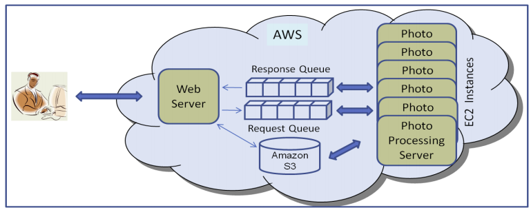

# Cloud Computing: IaaS project

## Aim
- **Auto scaling of EC2 instances based on the number of requests**
- Able to handle multiple requests concurrently.
- The application should handle all the requests as fast as possible, and it should not miss any request. The recognition requests should all be correct.

## Components
- Frontend to provide user input (which is an image)
- Web server
  -  The most important part as it will register request
  -  Autoscaling should be triggered from here only.
  -  Request will be sent to SQS from here
- SQS (Request Queueing mechanism)
  - We need to maintain a EC2 counter which should not cross 20 instances
  - If ec2Counter == 20, don't dispatch anything from the queue.
  - > SQS messages support 256 kb of text. Need to figure out how to send images.
  - > Autoscaling based on IaaS vs SQS based autoscaling
- Application Server
  - Business logic is already provided i.e the deep learning model
  - Take image input from SQS.
  - Apply the model on the input
  - Return the output result
  - > Return where?? Via SQS only?
  - > If AT fails, all the requests are queued in SQS until AT recovers. What if web tier fails??
- Data storage
  - > Not able to understand
  - Inputs stored in one S3 bucket
  - Ouputs stored in one S3 bucket in (input, output) pairs

## Architecture

### End-to-End flow
- User inputs image in the web-form.
- Image is sent to the web server via POST request.
- Web server stores the image in S3.
- Web server enqueues the request (only text) and pointer to image (image identifier in S3).
- App server dequeues the request.
- App server uses the image pointer to fetch the image from S3.
- App server runs the deep learning model on this image.
  - On Success:
    - Stores image and it's classification in S3
    - Returns response by enqueuing the response queue.
    - Deletes the message from SQS.
  - On Failure:
    - System Failure
      - On App server EC2 instance failure, the request will keep getting queued.
    - Failure to classify image/ Invalid input
      - Proper response with Http code will be returned to user.

### Doubts
- Do we need multi-threading at web-tier?
- Can we use AWS documentation code or snippets from StackOverflow?
  - Will there be any plagiarism check?
  - Is it even plagiarism?

### To-discuss
1. Use one aws account for the entire project.
2. Since we removed Controller from our design, now we don't need individual web server listening on App-tier instances. We just need a polling mechanism (i.e an infinite while loop) which will poll the SQS URL for new messages. This makes Bvya's work relatively easy at App tier.